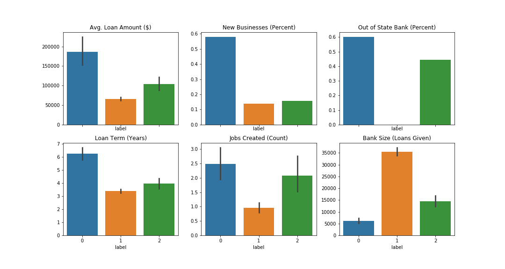

# Cluster Analysis of Defaulted Loans
Clustering defaulted small business loans to better understand how to help struggling businesses. Data is from the Small Business Administration, and is included in this repo. [Kaggle link here](https://www.kaggle.com/mirbektoktogaraev/should-this-loan-be-approved-or-denied?select=SBAnational.csv). Several clustering techniques, including DBSCAN, Agglomertaive Cluserting, and K-medoids wer compared, with K-medoids chosen as best suited to the data. 

### Findings
Three clusters were identified. By characterizing different businesses, more targeted assistance stratgeies can be applied. Clusters separated on loan amount and term; existing/new business and number of jobs created; and bank size and if the bank was out-of-state relative to the business. Larger, longer loans are interpreted as less risky. It would be useful to know business age, and not just new or existing status. Bank size and state are interpreted as a measure of difficulty finding credit. It is assumed samller, in-state banks can take on less risk than larger, out-of-state banks.

**Cluster 1 Features:**
* Highest Percentage of New Businesses
* Biggest Loans, Longest Average Loan Term
* Smallest Banks, but most out-of-state
* Created the most jobs

Interpretation: Promising new businesses that faltered

**Cluster 2 Features:**
* High percent of In-State Banks, Biggest Banks
* Highest percent of Existing Businesses
* Shortest Average Loan Term
* Created the Least Jobs
* Biggest Cluster (~500 loans)

Interpretation: Established businesses with exhausted local credit options and slowing growth

**Cluster 3 Features:**
* Similar businesses to Group 2
* In-between loan sizes and terms
* Medium sized, in-state banks

Interpretation: Businesses on their way to burning out, with characteristics of the first two clusters. These businesses may need more individualized assistance.

### Limitations
* Interpretation of Bank Size and State
  * Some businesses may go out of state for lower rates
  * Interpreted here as struggling to find credit
* Would like to know if these businesses have sought SBA loans before
  * Also business age, not just new or existing status
* The original data was very skewed. Transforming the data resulted in similar cluster results
  * Having SBA insight on what is extreme vs an actual outlier can strengthen analysis
  
### Suggested Actions

* New businesses and established businesses have different needs
  * New Businesses:
  * Marketing, Operations, and Vision
  * Help get a foothold
* Established Businesses:
  * Assist with upscaling
  * Connect with contractors for new responsibilities
* Advise businesses on credit opportunities based on what has already been utilized

